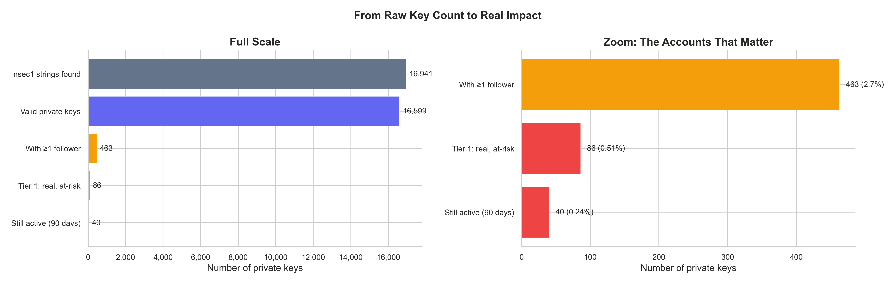
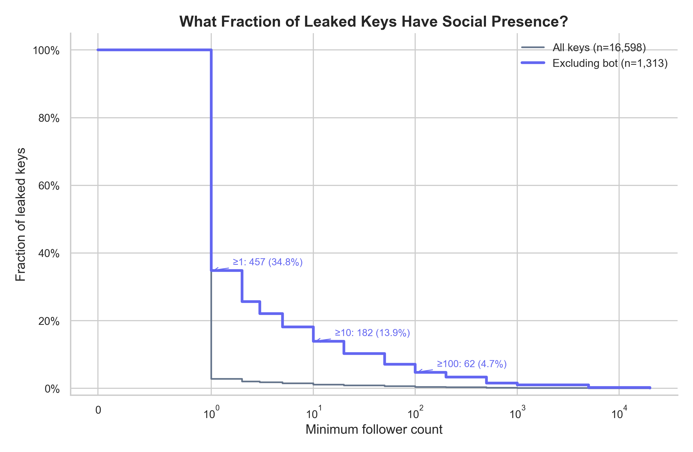
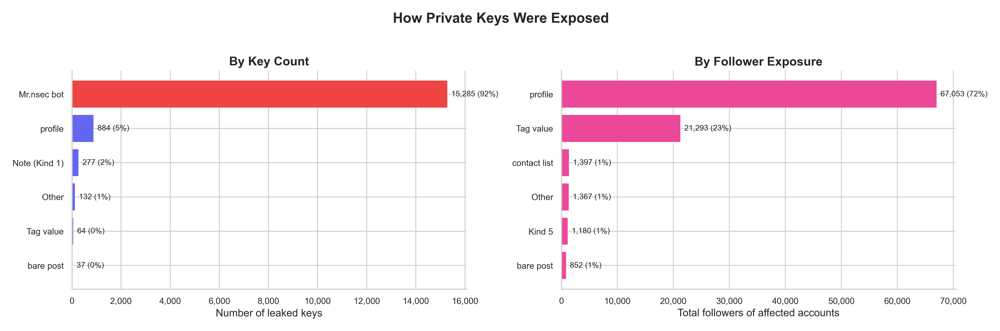
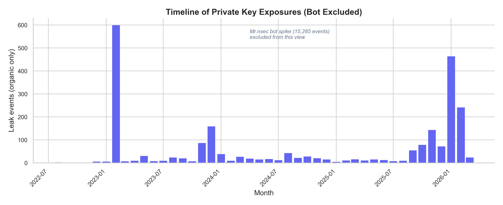
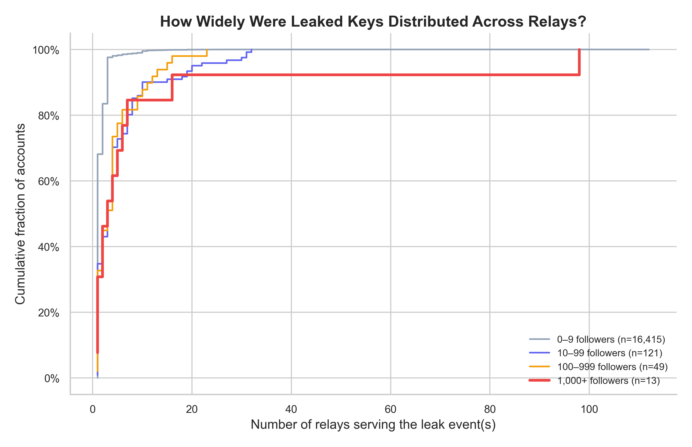
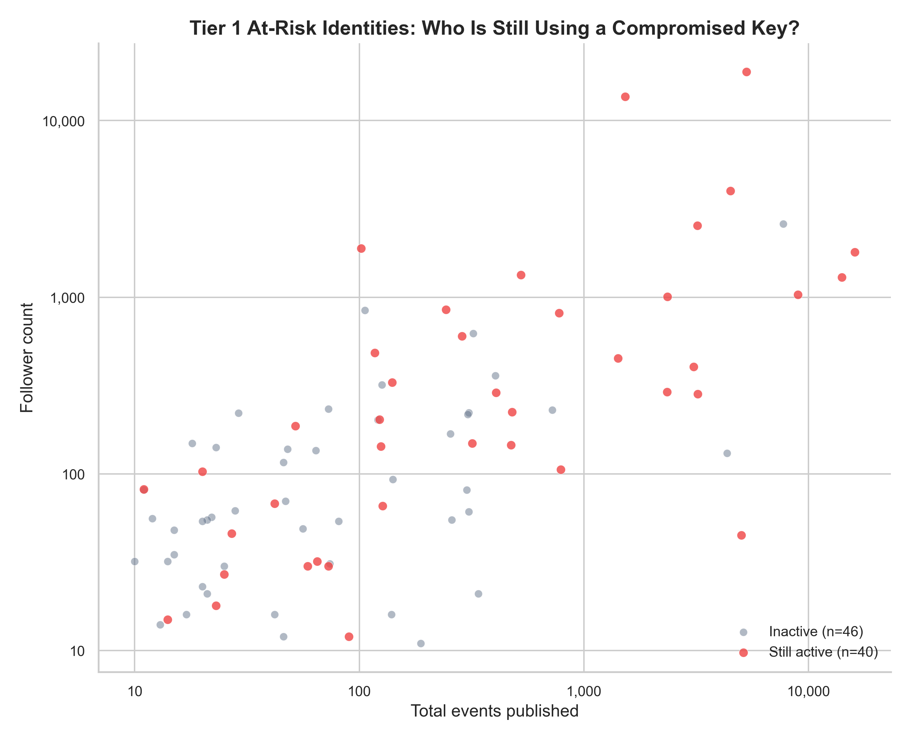

Your Nostr identity is a key pair. The `npub` is public — share it everywhere. The `nsec` is private — leak it and anyone can impersonate you. There is no password reset, no support ticket, no recovery. The nsec *is* the account.

So what happens when private keys end up published in plaintext on the very network they grant access to?

We set out to answer this question using BigBrotr's event archive — over **41 million events** collected from **1,085 relays** across clearnet, Tor, and I2P networks over 48 hours of continuous synchronization.

## Searching for nsec Strings

We searched every archived event — both the `content` field and `tags` — for strings matching the `nsec1` Bech32 prefix. Each match was extracted via regex and validated by attempting to derive a public key from it using the secp256k1 curve.

| Metric | Count |
|--------|------:|
| Events containing `nsec1` | 17,956 |
| Unique nsec strings found | 16,941 |
| Valid private keys | **16,599** |
| Invalid (truncated or fake) | 342 |

16,599 valid Nostr private keys, published in plaintext, recoverable by anyone with access to a relay archive. But that number is misleading.

## The Headline Number Is Noise

Anyone can publish a private key — including bots that mass-produce throwaway accounts. A single bot, which we call "Mr.nsec," accounts for **15,285** of those 16,599 keys (92%). It creates throwaway accounts named `Mr.{nsec}` with the bio `"Just your average nostr enjoyer"` — each publishing a single profile event exposing a different private key, each from a unique throwaway pubkey that is never used again.

By key count, the bot dominates the dataset. But the accounts whose keys it republishes have almost no followers. By social impact, the bot is irrelevant.

The real question is not *how many keys are exposed* but **how many real identities are at risk**.

## From 16,599 to 38

We applied successive filters to narrow down to the accounts that actually matter:

| Filter | Keys | % |
|--------|-----:|--:|
| nsec1 strings found | 16,941 | 100% |
| Valid private keys | 16,599 | 98.0% |
| With at least 1 follower | 463 | 2.7% |
| Real identity at risk | 86 | 0.5% |
| Still active (last 90 days) | 40 | 0.24% |
| **No signs of compromise** | **38** | **0.22%** |

A "real identity at risk" is defined as: at least 10 followers, a profile with a name, at least 10 events published, and the nsec was not published by the account itself (excluding intentional sharing and self-leaks). Of those 86, we checked which ones were still active and manually inspected each profile for signs of unauthorized use.

**38 accounts are actively using a compromised key with no visible signs of awareness.** They collectively have over **21,000 followers**. Two additional accounts show clear signs of unauthorized use (profile defaced, spam content).

The 2.7% figure is itself inflated by the bot. When we exclude bot-generated keys, **35% of organically leaked keys** belong to accounts with at least one follower:

## Self-Leak vs Third-Party

Excluding the bot, who published the remaining 1,314 organically leaked keys?

| Authorship | Keys | % of keys | Followers exposed | % of followers |
|------------|-----:|----------:|------------------:|---------------:|
| Self-leak | 742 | 56.5% | 26,924 | 29.6% |
| Third-party | 572 | 43.5% | 63,945 | **70.4%** |

The split is nearly even by key count — **56% self-leak, 44% third-party.** But the follower distribution is heavily skewed: third-party leaks account for **70% of all follower exposure**, because they disproportionately target accounts with social presence. Self-leaks are mostly users pasting their nsec into a profile field, confusing it with their npub — typically new accounts with few followers.

## Leak Vectors: Key Count vs Social Reach

Within the vector breakdown, the same inversion occurs:

By key count, the Mr.nsec bot dominates at 92%. By follower exposure — the metric that actually matters — profile-field leaks dominate at 74%. The bot republished thousands of keys, but they belonged to accounts with near-zero social presence. The real damage is done by users who accidentally pasted their nsec into a profile field. Smaller categories include AI agents publishing credentials in operational logs, nsec strings in contact list relay fields, and bare nsec posts.

## The Organic Leak Rate

Removing the bot reveals the underlying trend of organic key exposure:

The bot operated in a single burst. The organic rate is steady and ongoing — **a persistent UX problem, not a one-time attack.** As long as clients allow users to paste nsec strings into profile fields without warning, new keys will continue to be exposed.

## Relay Spread

How many relays serve each leaked key?

The median leaked key is available on just 1 relay. But accounts with more followers tend to see their leak events on more relays — up to 30+ for the most popular ones. This is expected: popular accounts' events are replicated more widely in general, not just leak events. Regardless of the cause, the practical implication is the same: for accounts with wide relay distribution, deleting the event from one relay is insufficient. **Key rotation is the only reliable remediation.**

## The 38 Accounts That Need to Know

Of the 86 real identities with exposed keys, 40 have posted in the last 90 days. We manually inspected each profile to determine whether the account showed signs of compromise (spam, defaced profile, incoherent content) or appeared to be used normally.

**38 accounts show no signs of compromise** — they appear to be used normally by the original owner, who likely does not know their private key is publicly available. Two accounts show clear signs of unauthorized use.

| Followers | Events | Leak date | Last active | Status |
|----------:|-------:|-----------|-------------|--------|
| 18,900 | 5,288 | 2024-12-27 | 2026-03-15 | compromised |
| 13,657 | 1,525 | 2023-11-18 | 2026-02-10 | compromised |
| 3,995 | 4,485 | 2023-08-24 | 2026-03-15 | no signs |
| 2,543 | 3,195 | 2024-11-18 | 2026-03-16 | no signs |
| 1,887 | 102 | 2023-12-01 | 2026-01-24 | no signs |
| 1,800 | 16,050 | 2023-12-11 | 2026-03-15 | no signs |
| 1,337 | 525 | 2024-04-12 | 2026-03-15 | no signs |
| 1,295 | 14,069 | 2023-12-05 | 2026-03-16 | no signs |
| 1,034 | 8,949 | 2024-11-03 | 2026-03-16 | no signs |
| 1,006 | 2,349 | 2023-09-17 | 2026-03-16 | no signs |

The remaining 30 accounts (12–851 followers) all show no signs of compromise.

## Check If Your Key Is Exposed

We deployed an [nsec-leak-checker](https://github.com/BigBrotr/nsec-leak-checker) — a Nostr DVM (Data Vending Machine) that lets you check if your private key has been found in public events. Send a Kind 5300 event signed with your keys (with a `p` tag pointing to the DVM's pubkey), and it responds with a NIP-44 encrypted message that only you can read.

## What Clients and Relay Operators Can Do

This isn't a protocol vulnerability — Nostr's key-based identity model is sound. The leaks are user errors, client oversights, and AI agent carelessness.

**Clients** should reject nsec strings in profile fields before signing the event. A regex check on Kind 0 content before broadcast would prevent the most damaging leak category entirely.

**Relay operators** could reject events containing valid nsec strings. This is more aggressive and has trade-offs (false positives on educational content, shared accounts), but it would neutralize the bot completely.

**AI agent developers** should sanitize logs before publishing them as events. Private keys and credentials have no place in broadcast messages.

**Users** should understand the difference: `npub` is your address, `nsec` is your password. If you've ever pasted an nsec into a profile field, **generate a new key pair immediately**.

## Limitations

This analysis covers 1,085 of 2,009 known relays over approximately 48 hours of synchronization. The actual number of exposed keys across the full network is likely higher. We search only for the literal string `nsec1` — keys in hexadecimal format or obfuscated in any way are not detected. Follower counts reflect the current state of the network, not the state at the time of the leak. Account lifespan calculations are based on the earliest and latest events in our archive, which may not correspond to the account's true creation date. The self-leak exclusion filter is conservative: it removes all keys published by the account itself, including accidental self-leaks by users who are genuine victims of UX confusion.

## Methodology

All data was collected by BigBrotr's Synchronizer service, archiving events from 1,085 relays using cursor-based pagination with binary-split windowing. nsec validation was performed using the `nostr-sdk` Python library. Follower counts were computed from the latest Kind 3 (contact list) event per pubkey. Profile data was extracted from the latest Kind 0 event. Recent activity was defined as any event published in the last 90 days. The 40 active at-risk accounts were manually inspected via their public profiles.

The full dataset is available for researchers upon request.
